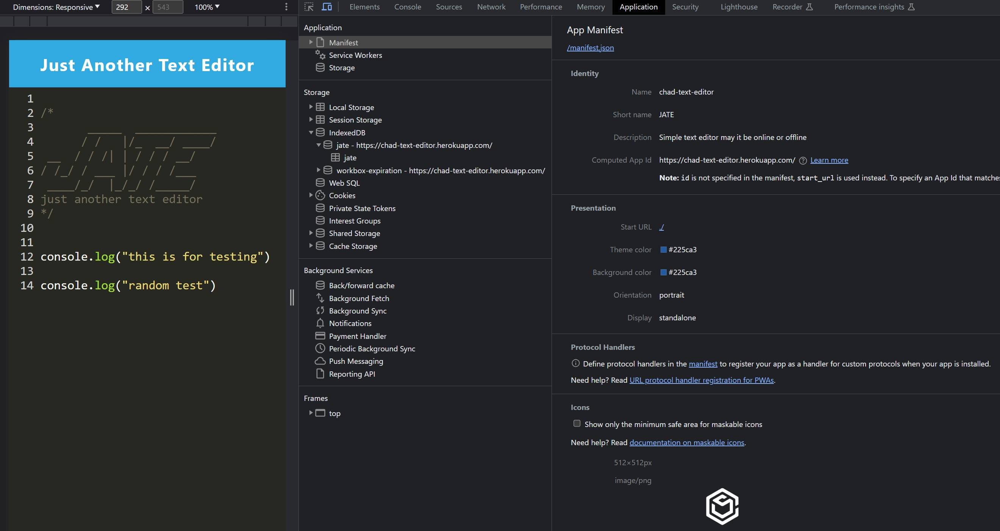
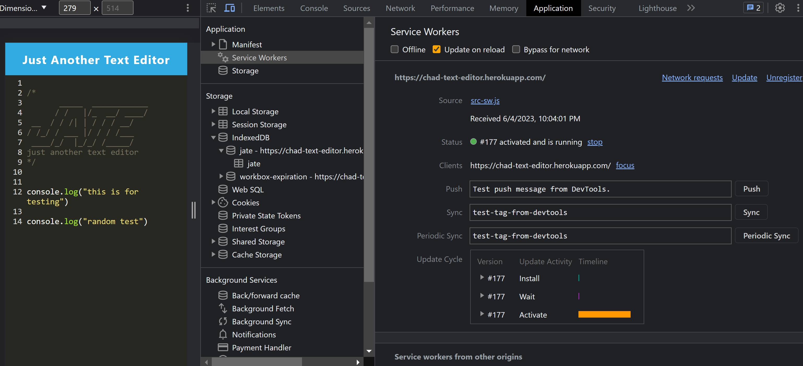

# PWA Just Another Text Editor (JATE)
This Text Editor Web Application is a Progressive Web Application (PWA) that runs in any browser (Chrome, Edge, Brave, etc.), whether online or offline and can be installed locally as well in a true PWA fashion.


## Table of contents
* [User Story](#user-story)
* [Acceptance Criteria](#acceptance-criteria)
* [Description](#description)
* [Screenshots](#screenshots)
* [Features](#features)


## User Story

```
AS A developer
I WANT to create notes or code snippets with or without an internet connection
SO THAT I can reliably retrieve them for later use
```


## Acceptance Criteria

```
GIVEN a text editor web application
WHEN I open my application in my editor
THEN I should see a client server folder structure
WHEN I run `npm run start` from the root directory
THEN I find that my application should start up the backend and serve the client
WHEN I run the text editor application from my terminal
THEN I find that my JavaScript files have been bundled using webpack
WHEN I run my webpack plugins
THEN I find that I have a generated HTML file, service worker, and a manifest file
WHEN I use next-gen JavaScript in my application
THEN I find that the text editor still functions in the browser without errors
WHEN I open the text editor
THEN I find that IndexedDB has immediately created a database storage
WHEN I enter content and subsequently click off of the DOM window
THEN I find that the content in the text editor has been saved with IndexedDB
WHEN I reopen the text editor after closing it
THEN I find that the content in the text editor has been retrieved from our IndexedDB
WHEN I click on the Install button
THEN I download my web application as an icon on my desktop
WHEN I load my web application
THEN I should have a registered service worker using workbox
WHEN I register a service worker
THEN I should have my static assets pre cached upon loading along with subsequent pages and static assets
WHEN I deploy to Heroku
THEN I should have proper build scripts for a webpack application
```


## Description

In a true PWA fashion, this project runs in the browser whether it is online and offline.


## Screenshots

Screenshot of the Manifest on the dev tools


Screenshot of the Service Worker on the dev tools


Screenshot of the IndexedDB on the dev tools


## Features
* Javascript
* Babel
* Nodemon
* Webpack & Workbox
* Workbox
* Heroku
* Dev tools
* Express
* NodeJS


## 🔗 Link to GitHub Repo Page
https://github.com/APOLAKl/PWA-Text-Editor   [](https://github.com/APOLAKl/PWA-Text-Editor)


## 🔗Link to Live Heroku

<mark>https://chad-text-editor.herokuapp.com/</mark>